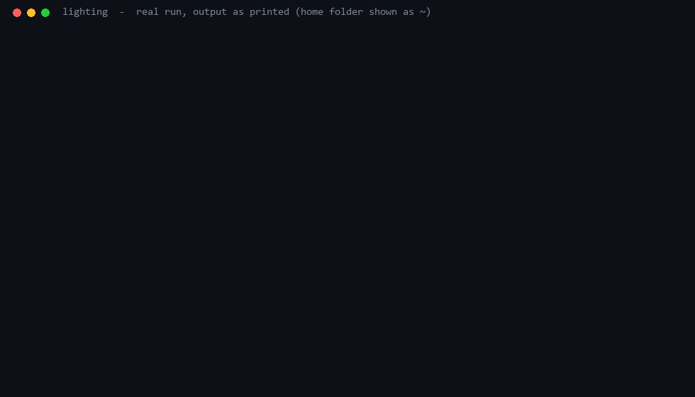
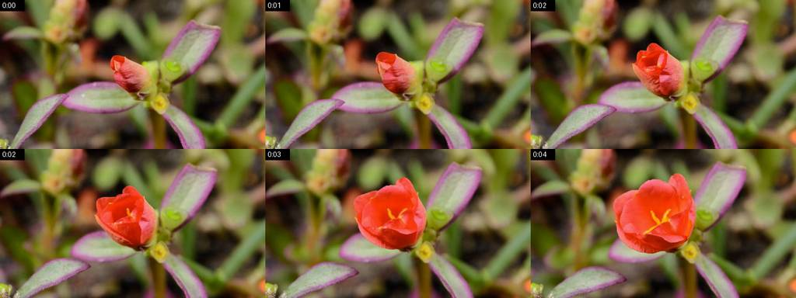

<h1 align="center">Lighting</h1>

<p align="center">
  <em>Your real browser and every Windows app, as a few lines of text.</em>
</p>

<p align="center">
  
  
  
  
  
  
  
  <br>
  
  
  
</p>

<h3 align="center">An AI that looks at a page with screenshots pays ~15,850 tokens. Lighting pays ~440.</h3>

<table>
<tr>
<th width="50%">📸 Screenshot agent · ~15,850 tokens</th>
<th width="50%">🔦 Lighting · ~440 tokens</th>
</tr>
<tr>
<td valign="top">

One screenshot (**~2,350** image tokens), then the page as text (**~13,500** tokens, cut off at 50,000 of 64,787 characters). After every click: another screenshot, another **~2,350**. And it is logged out, because it drives a fresh browser.

</td>
<td valign="top">

```
[t17] QDHShamiro/Lighting: Claude Code plugin ... - github.com/QDHShamiro/Lighting
e16 link "Issues" ->./issues
e17 link "Pull requests" ->./pulls
e27 button "Star QDHShamiro/Lighting"
...
```
One call. Everything clickable has a ref. A click answers in one line (**13-53** tokens). Your real browser, your logins.

</td>
</tr>
</table>

<p align="center"><b>A 10-step task: ~37,000 tokens with screenshots, ~890 with Lighting. That is ~36,000 tokens saved, every time.</b><br><sub>Computed from the measured rows below: 1 page look + 9 clicks with a screenshot each, against 1 <code>open</code> + 9 one-line clicks.</sub></p>

<p align="center">
  
  <br><sub>A real run rendered from the terminal output (only the home folder is shortened to ~): 8 commands, 6.7 s, ~713 tokens of output, everything closed again.</sub>
</p>

<p align="center">
  <a href="#quick-start">Quick start</a> ·
  <a href="#what-it-does">What it does</a> ·
  <a href="#built-for-claude">Built for Claude</a> ·
  <a href="#-the-numbers">The numbers</a> ·
  <a href="#how-it-compares">How it compares</a> ·
  <a href="#commands">Commands</a> ·
  <a href="#safety">Safety</a>
</p>

---

## Quick start

Windows 10/11, [uv](https://docs.astral.sh/uv/getting-started/installation/) and Brave, Chrome or Edge. In Claude Code:

```
/plugin marketplace add QDHShamiro/Lighting
/plugin install lighting@lighting
/lighting:setup
```

`/lighting:setup` loads the extension into your browser by itself, runs the self-test and tells Claude Code to use
Lighting for browser and desktop work. Then just ask, for example *"open my GitHub notifications and summarize them"*.
Codex, Cursor, Gemini CLI, VS Code, Claude Desktop, LM Studio / Bionic, Cline, Roo Code, Zed: see [Install](#install).

## The problem

You ask your AI to check something on a website. It takes a screenshot: ~2,350 tokens. It reads the
page: ~13,500 tokens, cut off halfway. It clicks, and takes another screenshot to see what happened.

Ten steps later the context is full of pixels and accessibility dumps, and the AI is still logged
out, because it drives a fresh browser that knows none of your accounts.

None of that is what the AI needs. It needs to know what it can click, and whether the click worked.

## What it does

| | |
|---|---|
| 🌐 **Your real browser** | Brave, Chrome or Edge with all your logins, through a small extension. Lighting's tabs live in their own orange "Lighting" group, in the background. |
| 🪟 **Every Windows app** | UI Automation for normal apps, OCR for games and canvas UIs. Clicks and typing go through in the background; your mouse stays where it is. |
| 🧠 **Learns your tasks** | Do something twice and it becomes a routine that runs in one call ([how](#the-second-time-is-one-call)). |
| 🎞️ **Sees images and video** | `snap --media` lists images, `shot e57` shows one, `frames e40` turns a whole video into one contact sheet. |
| 🧹 **Cleans up after itself** | When the AI finishes its reply, what it opened closes again. The tab group's color is a status light: orange working, red stopped, green done. |
| 🔒 **Safe by default** | Banking sites are read-only, buy/pay/delete/merge buttons need `--yes`, hidden text never reaches the model, secrets never reach the log. |

Every answer is short text with refs:

```
$ lighting open github.com/QDHShamiro/Lighting -f "Issues|Pull requests"
[t1] QDHShamiro/Lighting: Claude Code plugin: control your real browser ... - github.com/QDHShamiro/Lighting
e1 link "All issues" ->/issues
e2 link "All pull requests" ->/pulls
e3 link "Issues" ->./issues
e4 link "Pull requests" ->./pulls
more: 74 below (scroll or snap --all)
! routine github-issues can finish this in one call: lighting run github-issues page=Lighting
$ lighting click "Issues"
ok e3 -> github.com/QDHShamiro/Lighting/issues
```

```
  your AI ──Bash──→ lighting.exe (Rust) ──┐
  your AI ──MCP───→ lighting mcp ─────────┴─→ daemon ──┬─→ extension ──→ your open browser
                                                       ├─→ UI Automation ──→ Windows apps
                                                       └─→ Windows OCR ──→ games, canvas UIs
```

Only visible, usable elements are listed. Hidden text never reaches the model, links under the
current page are shown as `./path`, tracking parameters are dropped, and a page header, a 60-link
footer or a header that repeats from the last page collapse to one line. You pay for what you can act on.

### Images and video

<p align="center">
  
  <br><sub><code>lighting frames e1</code> on a 5-second CC0 clip: 6 moments in one image, ~518 tokens, 0.9 s.</sub>
</p>

`frames e40` jumps to 6 moments spread over the full length of a video (a 14-minute talk in 2.1 s instead of
14 minutes), with timestamps and the captions at each moment, muted, and puts the video back where it was.
`--scenes` picks the 6 most different scenes out of 24, `--from 1:30 --to 2:00` looks at one part, `--live`
watches in real time (streams). `snap --media` gives every image a ref with its caption as name, and
`shot e57` saves just that image (~112 tokens for a Wikipedia photo).

### It cleans up after itself

When the AI finishes its reply, the tabs and apps it opened close again and the window you were in
comes back to the front (`lighting done`, run by a Claude Code hook). A tab you are looking at stays,
an app that was open before stays, an app with unsaved work is only asked to close. `lighting keep`
hands a tab or app over to you; `lighting config cleanup off` keeps everything open.

## The second time is one call

An AI that does a task twice pays twice: every snapshot, every click, every thought. Lighting keeps a
trace of each task with stable targets (`click "Sign in"`, not `e12`). When a task ends, it aligns it
with earlier ones like DNA sequences; the parts that differ become parameters.

```
  run 1   launch spotify:search:SOS    → snap → click "SOS wiedergeben"
  run 2   launch spotify:search:Numb   → snap → click "Numb wiedergeben"
          ! learned routine spotify-wiedergeben from 2 runs
  run 3   lighting run spotify-wiedergeben search=SOS
          ok spotify-wiedergeben: 2 steps in 1.4 s, verified -> yukan archive - SOS - Spotify.exe
```

- **Learns by itself.** Seen twice, a routine exists. No prompt, no naming, no setup.
- **Speaks up.** Start a known task and the first output says `! routine X can finish this in one call`.
- **Checks its work.** A run passes only when the result shows up (the song in the window title, the repo in the URL).
- **Repairs itself.** A step breaks, the AI finishes by hand, Lighting rebuilds the routine from what worked (`v2`).
- **Keeps score.** Runs, success rate, time and tokens saved per routine; three failures in five runs mark it `FLAKY`.
- **Or just show it.** `lighting record start`, do it yourself in the browser or any app, `lighting record stop song=SOS`.

```
$ lighting routines
github-issues page= | 2/3 ok, 3.4 s, saved ~1.7k tokens | open github.com/QDHShamiro/{page} > click Issues
spotify-wiedergeben search= | 2/2 ok, 1.4 s, saved ~181 tokens | launch spotify:search:{search} > click "{search} wiedergeben"
```

(The failed `github-issues` run was a repo that does not exist: it clicked the global Issues link, the
check caught it.)

## Built for Claude

Every step of an AI agent costs a model round of 1-5 seconds, and everything a tool prints stays in the
context. So Lighting saves steps first and tokens second:

- **One call instead of two.** `open <url> -f "Issues|Pull"` returns only the matching lines,
  `do "fill Email=a@b.c; click Continue; expect Welcome"` runs a whole sequence, a known task is `run <name> k=v`.
- **Answers you can act on.** Everything clickable has a ref (`e12` web, `d5` app, `t4` tab, `w2` window).
  An action answers with one line and what changed; the header says where you are (`[t4]` tab, `[w2]` window).
- **Errors name the next step.** `err: nothing matches "Log in" -> try: lighting snap -f "log in"`.
- **Small by construction.** Headers, navs and repeated lists collapse to one line, the first look at a page
  stops at 1,600 characters, big results go to a file and only the path is printed.
- **Knows the cheapest way.** The skill teaches the ladder: an API or `read <url>` (no browser) → `open -f` →
  `snap -f` → `text` → `shot`, and says when a learned routine can finish the task.
- **Leaves no mess.** A plugin hook closes what the agent opened after every reply; `keep t3` hands a tab to you.
- **Fast on both paths.** A Bash call costs ~55 ms, almost all of it Git Bash starting a process. Through MCP a
  call costs 1.2 ms and a browser command 2.9 ms.

Want every agent on your PC to prefer it? Put this in `CLAUDE.md` or `AGENTS.md`:

```markdown
- Browser and desktop: use the `lighting` command (skill "lighting") for all web and Windows UI work.
  Cheapest first: `lighting read <url>` for public pages, `open <url> -f "words"` when you know what you
  need, `do "a; b; c"` for sequences, `run <routine>` for known tasks. Screenshots only when looks matter.
```

---

## 📊 The numbers

Every number here comes from a run you can repeat: `lighting bench`, `lighting bench --real`, `lighting selftest`.
Brave 154, Windows 11, Lighting 0.7.2. Tokens are characters / 4. Small numbers stay small, and a row where the comparison does not work says so.

### Per action

| Action | Without Lighting | With Lighting | Saved |
|---|---:|---:|---:|
| Look at a page (GitHub repo) | ~15,850 (screenshot + page text) | **~440** (`open`) | **−97%** |
| See a 14-minute video (6 moments) | ~14,100 (6 screenshots, waiting while it plays) | **~518** (`frames`, one image, 2.1 s) | **−96%** |
| See what a click did | ~2,350 (new screenshot) | **13-53** (one-line change report) | **−98%** |
| Find one thing on a page | ~2,350 (screenshot) | **~36-50** (`snap -f`) | **−98%** |
| Do a known task again (a repo's issues) | ~916 (every step by hand) | **~40** (`run github-issues`, 1 call) | **−96%** |
| Screenshot, when you really need one | ~2,350 | ~700 (1024 px JPEG) | **−70%** |

### Whole page text, 6 real sites

`lighting text` against the page's own rendered text (`document.body.innerText`), which is already much smaller than what screenshot agents read. `text` keeps the first 6,000 characters in the answer and writes the rest to a file, so long pages save the most.

| Site | Page text | `lighting text` | Saved |
|---|---:|---:|---:|
| Wikipedia, Minecraft | 38,789 | 1,509 | **−96%** |
| GitHub repo | 2,713 | 1,503 | −45% |
| YouTube home | 908 | 682 | −25% |
| Hugging Face models | 993 | 866 | −13% |
| Modrinth plugins | 1,303 | 1,203 | −8% |
| TikTok For You | (no DOM text, video only) | 24 | n/a |
| **Total** | **44,706** | **5,763** | **−87%** |

### Speed

| | |
|---|---|
| `snap` on GitHub, YouTube, Modrinth, Hugging Face, TikTok | 4-24 ms |
| Browser command through MCP (`snap`, `js`, `tabs`) | 2.9 ms (was 17.5 ms before 0.7.0) |
| Browser command through Bash | ~70 ms, of which ~55 ms is Git Bash starting a process |
| Click with navigation check and change report | ~135 ms |
| `shot` / `shot e5` | 172 ms / 100 ms |
| `open` a real site (includes the page load) | 1.3-4.7 s (a light page: 330 ms) |
| Cold start through `rtk` or any pipe | no hang (fixed in 0.5.0) |

- `lighting selftest`: **125/125** (browser, desktop, chat and sessions, cold start included). Unit tests: `python tests/test_units.py` (24/24), `cargo test` in `client/`.
- `lighting bench --real` times GitHub, Wikipedia, YouTube, Modrinth, Hugging Face and TikTok, prints the page-text comparison above and compares with the last run.
- Filling and submitting a form: ~160 ms.
- GitHub diff with 62,000 elements: `snap` 0.11 s, `scroll` 0.17 s.

## How it compares

| | Lighting | Claude in Chrome | Playwright MCP | agent-browser |
|---|---|---|---|---|
| Your real browser profile and logins | ✅ | ✅ | fresh profile | own browser |
| Windows apps (UI Automation + OCR) | ✅ | – | – | – |
| Tokens for a first look at a page | **~440** (measured) | ~15,850: screenshot + page text (measured) | 15,000-30,000 on dense pages ([1]) | ~1,400 ([2]) |
| Repeated tasks | learned routines, one call | saved shortcuts | – | – |
| A whole video as one image | ✅ `frames` | – | – | – |
| Headless, CI, Linux, macOS | ❌ Windows, real browser | desktop Chrome, no headless | ✅ | ✅ |

`–` means not built in as far as the public docs say. Lighting is the wrong tool for headless tests, CI or
Linux/macOS: take Playwright there. It is built for the other case: an agent on your Windows PC that has to use
your logged-in browser and your apps, cheaply.

[1]: https://lite.ego.app/article/playwright-mcp-token-problem
[2]: https://github.com/vercel-labs/agent-browser

## What's new

- **0.9.0** Hears videos: `listen` says what a TikTok or YouTube video says (captions, else speech-to-text), also
  for logged-in videos by recording the tab. Every Claude session keeps its own tabs and cleans up only those;
  `unread` shows waiting Discord messages; `search youtube "x"` jumps to results and learns new sites; `net` shows
  the JSON behind a page; Discord snapshots are 36% smaller; routines call routines; WebMCP tools.
- **0.8.0** Chats and fewer rounds: `reply "@Name" "hi" --wait` sends in Discord and waits for the answer in one
  call, `inbox` reads new messages in full; `-f` after any action shows its result; `wait --reload` instead of
  sleep loops; `search`, `open --text`, app links (`obsidian://`); desktop actions report what changed;
  shortcuts learned per app (`lighting keys`); routines found from the request itself. The skill got smaller.
- **0.7.1** Claude uses it better: `js` with `const` no longer clashes between calls, `type focused` right after
  `launch` works, merge buttons need `--yes`, the skill has the rules agents tripped over and is 9% shorter.
- **0.7.0** Speed pass: a browser command through MCP 17.5 → 2.9 ms, screenshots 37-54% faster, `open -f`.
- **0.6.0** Video analysis over the whole video with captions and scenes; leaner snapshots.
- **0.5.0** Cleans up after itself, status light, images, CI and releases with SHA-256 checksums.

All changes: [CHANGELOG.md](CHANGELOG.md).

---

## Install

Requirements: Windows 10/11, [uv](https://docs.astral.sh/uv/getting-started/installation/), and Brave, Chrome or Edge.

**Claude Code**

```
/plugin marketplace add QDHShamiro/Lighting
/plugin install lighting@lighting
/lighting:setup
```

**Codex**

```
codex plugin marketplace add QDHShamiro/Lighting
```

Then install `lighting` from `/plugins`, and run once in a terminal:

```
<plugin folder>\bin\lighting.exe setup
lighting install codex
```

**Cursor, Gemini CLI, VS Code (Copilot), Windsurf, Claude Desktop, LM Studio / Bionic, Cline, Roo Code, Zed, any MCP client**

```bash
git clone https://github.com/QDHShamiro/Lighting.git
Lighting\bin\lighting.exe setup
lighting install cursor        # or: gemini | vscode | windsurf | claude-desktop | codex
                               #     bionic | lmstudio | cline | roo | zed
```

`install bionic` (same as `lmstudio`) also copies the Lighting skill into `~/.lmstudio/skills/lighting`,
where Bionic picks up global skills; later updates refresh that copy.

`setup` installs the Python side into `~/.lighting`, registers the native messaging host,
**loads the extension into your browser by itself** (it opens the extensions page, switches on
Developer mode and picks the folder through UI Automation) and puts `lighting` on your PATH.
`install <ai>` adds the MCP server to that AI's config and leaves everything else in it alone.

<details>
<summary><b>MCP config by hand</b></summary>

```json
{
  "mcpServers": {
    "lighting": {
      "command": "C:\\Users\\<you>\\.lighting\\bin\\lighting.exe",
      "args": ["mcp"]
    }
  }
}
```

One tool, `lighting`, that takes one command line (`snap -f price`). Codex uses TOML:

```toml
[mcp_servers.lighting]
command = "C:\\Users\\<you>\\.lighting\\bin\\lighting.exe"
args = ["mcp"]
```

</details>

---

## Commands

**Browser** (your normal profile, all logins)

| | |
|---|---|
| Look | `open <url>` · `snap [-f "a\|b"] [-s e40] [--diff] [--all]` · `text` (Markdown via [Defuddle](https://github.com/kepano/defuddle)) · `read <url> [url2 ...]` (pages and PDFs, no browser) · `shot --marks` |
| Act | `click` · `type` · `fill "Email=a@b.c" --submit` · `press` · `select` · `check` · `hover` · `drag` · `scroll --until "text"` · `upload` |
| Wait | `wait "text" \| url:/x \| 1500 [--gone]` · `expect "text"` |
| Data | `table e8` · `fetch /api/me --pick login` (with your cookies) · `js` |
| Tabs | `tabs` · `tab t3` · `close` · `back` · `reload` · `dialog accept\|dismiss` · `dismiss` (cookie banners) · `viewport 390x844` |
| Clean up | `done` (close what Lighting opened) · `keep [t3\|w2]` (hand it over to you) · `config cleanup off` (keep everything open) |
| Images, video | `snap --media` (images get refs, captions as names) · `shot e57` (look at one image) · `frames e40 [--scenes] [--from 1:30 --to 2:00] [--live]` (the whole video as one contact sheet, captions included) · `read <image url>` |

**Windows desktop**

| | |
|---|---|
| Start | `launch spotify` · `launch "spotify:search:SOS"` · `launch calc` (Win+R names and Store apps too) · `close w4` · `close "app:Rechner"` |
| Look | `windows` · `snap w2` (UI Automation) · `read w2` (OCR) · `shot w2` (even when covered) |
| Act | `click d5` · `click "Save"` · `click o3` (OCR text, real click, cursor goes back) · `type "Search" text` · `type focused text` · `press ctrl+s` · `clip get\|set` |

**Routines**

| | |
|---|---|
| Use | `routines [-f word]` · `run <name> param=value` · `routine show <name>` |
| Teach | learned by itself on repeat · `routine save <name> [param=value]` · `record start <name>` … `record stop [param=value]` |
| Tidy | `routine rm\|rename <name>` · `routine forget` (task history) · `config learn off` |

Clicks and typing go through UI Automation in the background, your mouse stays where it is.
`do "fill Email=a@b.c; click Continue; expect Welcome"` runs several steps in one call.
`lighting help` lists everything.

---

## Safety

- Banking and payment sites are read-only (`~/.lighting/blocklist.txt`).
- Buttons that look irreversible (buy, pay, delete, merge a pull request, ...) need `--yes`.
- Hidden text is never shown to the model, which blocks a common prompt-injection trick.
- A URL with a long query to a site not opened yet needs `--yes`, so injected instructions cannot quietly send data out.
- Secrets come from environment variables (`--env VAR`) and are never logged.
- **Ctrl+Alt+End** stops everything immediately.
- Every push runs CI (unit tests, all modules compile, extension parses, client builds with clippy clean). Every release carries `lighting.exe` built by CI from the tag and `SHA256SUMS.txt`, which also lists the hash of `bin/lighting.exe` in the repo: check yours with `certutil -hashfile bin\lighting.exe SHA256`, or build it yourself with `cd client && cargo build --release`.

<details>
<summary><b>Files it creates, and how to remove it</b></summary>

Everything lives in `%USERPROFILE%\.lighting\`: the Python venv, the extension copy, the native host,
`bin\lighting.exe`, the pipe key, the blocklist, a 24 h output cache and the action log (typed text
and secrets are never logged). Routines live in `routines\`, the last 300 tasks they are learned from
in `episodes.jsonl` (typed text included so routines can replay it; `--env` secrets are stored as
`@secret`; `lighting routine forget` clears it, `lighting config learn off` stops it). Registry: the
native messaging host keys for Brave, Chrome, Edge and Chromium, and `.lighting\bin` in your user `Path`.

```
lighting uninstall          # registry keys off, daemon stopped
lighting uninstall --purge  # also removes ~/.lighting except the venv
```

</details>

<details>
<summary><b>How it works</b></summary>

- The daemon starts on the first call and stays. The pipe is protected by a random token in `~/.lighting/key`.
- The extension only talks to the local native host, never to web pages.
- Snapshots are built in the page by a small script (no full accessibility tree), refs stay stable in the extension's isolated world.
- JavaScript dialogs do not freeze it: it reports them and waits for `dialog accept|dismiss`.
- Links that open a new tab switch the target automatically.

`HOW-TO-SETUP.md` has every trap this works around.

</details>

## Troubleshooting

| Symptom | Fix |
|---|---|
| `no browser ... connected` | `lighting setup` |
| `lighting: command not found` | open a new terminal after `setup`, or run `bin\lighting.exe setup` again |
| `cannot script this page` (brave://, Web Store) | `lighting snap w1 --web` controls the browser window instead |
| Something hangs | `lighting stop`, the next call starts a fresh daemon |

## Limits

- Windows only. Firefox is not supported (no `debugger` extension API).
- Cross-origin iframes: snapshot with `--frame host`, clicks there are DOM clicks.
- Apps running as administrator only take input when the terminal runs as administrator too.

## Development

```
cd client && cargo build --release && copy target\release\lighting.exe ..\bin\
lighting stop && lighting ext-reload && lighting selftest && lighting bench
claude plugin validate .
```

## License

MIT. Bundles [Defuddle](https://github.com/kepano/defuddle) (MIT, see `extension/defuddle.LICENSE.txt`).
